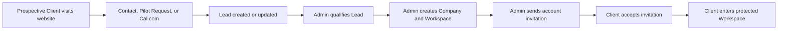

# BlihOps V1 User Flows

## 1. Purpose and Notation

This document describes how V1 users complete the main product journeys. It
focuses on navigation, decisions, handoffs, and outcomes. Detailed field rules
remain in the PRD, while screen-level states belong in the Screen Inventory and
wireframes.

```text
Action → Next action
[Decision?] → Branch
(System) → Automated action
```

## 2. Lifecycle Overviews

### 2.1 Company and Client Lifecycle



### 2.2 Candidate and Talent Lifecycle

```mermaid
flowchart LR
    A["Candidate applies (Round 1)"] --> B["Admin review and assessments"]
    B --> C["Admin approves Candidate"]
    C --> D["Admin sends completion request"]
    D --> E["Talent completes profile (Round 2)"]
    E --> F["Admin creates Talent Profile and account"]
    F --> G["Admin sends account invitation"]
    G --> H["Talent accepts invitation"]
    H --> I["Talent manages permitted profile fields"]
```



The Talent Application collects assessment information in Round 1; the remaining
profile-building fields are collected through a profile completion request after
approval. Account activation remains invitation-only.

## 3. Flow Catalogue

| ID | Main flow | Primary actor |
|---|---|---|
| AUTH-01 | Web login and role redirection | Client or Talent |
| AUTH-02 | Accept account invitation | Client or Talent |
| AUTH-03 | Reset password or recover from access failure | Protected user |
| AUTH-04 | Admin login | Admin |
| PUBLIC-01 | Submit a Contact inquiry | Prospective Client |
| PUBLIC-02 | Request a Pilot or book a call | Prospective Client |
| PUBLIC-03a | Apply to the Talent Pool (Round 1) | Candidate |
| PUBLIC-03b | Complete the Profile (Round 2) | Candidate |
| PUBLIC-04 | Browse published content or Careers | Visitor |
| ADMIN-01 | Qualify a Lead and create a Company | Admin |
| ADMIN-02 | Manage Company and Client access | Admin |
| ADMIN-03 | Review and assess a Talent Application | Admin |
| ADMIN-04 | Request completion, create Profile, and invite Talent | Admin |
| ADMIN-05 | Manage Interview Requests and Pilot progress | Admin |
| ADMIN-06 | Manage structured website content | Admin |
| ADMIN-07 | Manage email templates and Cal.com settings | Admin |
| CLIENT-01 | Review the Workspace Dashboard | Client |
| CLIENT-02 | Discover and review Talent | Client |
| CLIENT-03 | Create and manage a Talent Pod | Client |
| CLIENT-04 | Request an interview | Client |
| CLIENT-05 | Track Interview Requests and Pilot progress | Client |
| TALENT-01 | View and update the Talent Profile | Talent |

## 4. Shared Authentication Flows

### AUTH-01 — Web Login and Role Redirection

**Entry:** Client or Talent opens the shared BlihOps Web login.

```text
Enter email and password
→ Submit
→ (System) validates credentials and account access
→ [Valid Client] → Client Workspace Dashboard
→ [Valid Talent] → Talent Profile Management
→ [Invalid or unavailable] → Explain the issue and provide a safe recovery path
```

**Outcome:** The user reaches only the protected area permitted by their role.

### AUTH-02 — Accept Account Invitation

**Entry:** Client or Talent opens the emailed `/accept-invitation` link.

```text
(System) validates token and identifies account type
→ [Valid] → User creates password
→ Submit
→ (System) activates account and consumes token
→ [Client] → Client Workspace Dashboard
→ [Talent] → Talent Profile Management
```

An invalid, expired, or consumed token shows an explanatory state. Resending or
replacing an invitation remains an Admin action.

### AUTH-03 — Password Reset and Access Recovery

```text
Open Forgot Password
→ Enter email
→ Submit
→ Show neutral confirmation
→ Open emailed reset link
→ Set new password
→ (System) consumes token and invalidates older reset links
→ Return to the appropriate login
```

Wrong-role, archived, deactivated, or unauthorized access redirects to login or
an access-denied/unavailable state without exposing protected information.

### AUTH-04 — Admin Login

```text
Admin opens BlihOps Admin
→ Enter credentials
→ (System) validates the provisioned Admin account
→ Admin Dashboard
```

## 5. Public Website Flows

### PUBLIC-01 — Submit a Contact Inquiry

```text
Open Contact form
→ Enter contact and Company information
→ Submit
→ (System) validates and creates a CONTACT Lead with source page
→ Show confirmation and manual follow-up expectation
```

### PUBLIC-02 — Request a Pilot or Book a Call

```text
Open Pilot page
→ Enter Company, contact, and Pilot information
→ Submit
→ (System) creates a PILOT Lead
→ Show success with Book Discovery Call action
→ [Book call] → Cal.com scheduling
→ (System) creates or updates a BOOKING Lead with source provider CALCOM without duplication
```

A Visitor may also enter Cal.com directly from another Book a Call action.

### PUBLIC-03a — Apply to the Talent Pool (Round 1)

```text
Open Join Talent Pool
→ Enter identity, contact, screening, and professional assessment information
→ Upload required resume
→ Submit
→ (System) validates fields and file
→ Talent Application created as New
→ Show confirmation and expected next steps
```

Submitting an application creates the Talent Application only. After approval,
Admin must request the remaining profile-building information through a completion
request before the Profile and account can be created.

### PUBLIC-03b — Complete the Profile (Round 2)

```text
Open email link to /complete-profile with token
→ (System) validates the single-use 7-day token
→ [Valid] → Present the profile completion form with remaining fields:
  profile photo, short bio, availability, earliest start date, and preferred engagement
→ [Invalid, expired, or consumed] → Show link-status state (AUTH-06)
→ Fill form fields
→ Upload optional profile photo
→ Submit
→ (System) validates and updates the Talent Application with completion data
→ Application moves to Completion Submitted
→ Show confirmation and expected next steps
```

The completion form is unauthenticated and protected only by the single-use
token. It does not create a Talent Profile or account.

### PUBLIC-04 — Browse Published Content or Careers

```text
Choose active locale
→ Open Case Studies, Insights, or Careers
→ Browse published or active entries
→ Open selected detail
→ Follow the relevant Contact, Pilot, or Talent Pool action when desired
```

Only published locale-appropriate content and active Career roles are visible.

## 6. Admin Flows

### ADMIN-01 — Qualify a Lead and Create a Company

```text
Dashboard or Leads
→ Find and open Lead
→ Review source, details, notes, and status
→ Update qualification status
→ [Qualified and agreed] → Convert to Company
→ (System) checks for duplicate Company
→ Confirm conversion
→ (System) creates Company and one Client Workspace
→ Lead marked Converted
→ Open Company Detail
```

Admin may instead close, archive, restore, or continue managing the Lead.

### ADMIN-02 — Manage Company and Client Access

```text
Companies
→ Find and open Company
→ Review Company, Workspace, invitation, Pilot, requests, notes, and activity
→ Add or update the approved Client representative
→ Send shared account invitation
→ Track Pending or Accepted state
```

Admin can resend or replace an expired invitation, deactivate or reactivate the
Client account, and archive or restore the Company. Restoring a Company does not
automatically reactivate its Client account.

### ADMIN-03 — Review and Assess a Talent Application

```text
Talent Applications
→ Find and open application
→ Review candidate information and resume
→ Record notes and stage outcomes
→ Move through screening and required assessments
→ [Not suitable] → Reject with reason
→ [Requirements met] → Approve
→ Mark application ready for the mandatory profile completion request
```

Valid stages are controlled by the PRD. Only an approved application with a
submitted completion form can create the Talent Profile and associated account.

### ADMIN-04 — Request Completion, Create Profile, and Invite Talent

```text
Open approved Talent Application
→ Review application and assessment history
→ Send profile completion request (generates 7-day single-use token)
→ System sends the profile completion email to the candidate
→ Track Completion Requested state
→ [Expired or replaced] → Resend or replace the completion request
→ Talent submits completion form → Application moves to Completion Submitted
→ Review combined Round 1 application data and Round 2 completion data
→ Create Talent Profile and account
→ Choose active/visible state
→ Send shared account invitation
→ Track Pending or Accepted state
```

From Talent Profile Detail, Admin may edit all fields, publish or hide the
profile, resend the invitation, or archive and restore the profile. Restoring a
profile does not automatically make it visible to Clients.

### ADMIN-05 — Manage Interview Requests and Pilot Progress

```text
Companies
→ Open requesting Company
→ Review Interview Requests within Company Detail
→ Confirm requested Talent availability and contact Talent manually
→ Schedule and coordinate interviews
→ Update requests through Pending, Scheduled, Completed, or Cancelled
→ [Client requests more interviews] → Repeat interview coordination
→ [Client and BlihOps agree to proceed] → Create two-week Pilot
→ Define goals, dates, milestones, and participating Talent
→ Start Pilot
→ Record progress, milestone changes, and client-visible updates
→ Complete or cancel Pilot and record outcome
→ Client sees permitted Pilot progress throughout
```

Interview Requests remain within Company Detail; there is no separate Admin
Interview Requests page in V1. Completing an interview does not create a Pilot
automatically. Pilot work and communication remain outside the platform.

### ADMIN-06 — Manage Structured Website Content

```text
Content
→ Choose content type
→ Create or edit entry
→ Add localized content, shared fields, and media as required
→ Save draft or validate active/published state
→ Reorder, feature, activate, publish, or unpublish
→ (System) updates eligible public content and records activity
```

Important variations:

- Case Studies and Insights require valid English and German content to publish.
- Pilot FAQs require both locales before activation.
- Careers roles are English-only.
- Testimonials support text or video and require one active primary selection.
- Services Hero Media is one global media object.
- Destructive deletion requires confirmation.

### ADMIN-07 — Manage Email and Cal.com Settings

```text
Settings
→ Choose Email Templates or Cal.com
→ Review current configuration
→ [Email] → Edit template → Validate variables → Save
→ [Cal.com] → Review connection, webhook mapping, and last event
```

Sensitive Cal.com credentials are never shown in full.

## 7. Client Workspace Flows

### CLIENT-01 — Review the Workspace Dashboard

```text
Enter protected Client Workspace
→ Review Company and Pilot context
→ Review Talent, Pods, requests, and recent activity summaries
→ Open the relevant Workspace area
```

### CLIENT-02 — Discover and Review Talent

```text
Talent Directory
→ Search, filter, sort, or paginate
→ Review visible Talent cards
→ Open Talent Profile
→ Review client-visible professional, verification, availability, and rate data
→ Add to Pod or request interview
```

Hidden, archived, or otherwise unavailable profiles cannot be opened.

### CLIENT-03 — Create and Manage a Talent Pod

```text
Talent Pods
→ Create Pod with name and optional planning note
→ Add visible Talent from Pod, Directory, or Talent Profile
→ (System) prevents duplicate membership
→ Optionally select a current member as Pod Lead
→ Compare members and decide whom to interview
→ Rename Pod, update note, change Lead, or remove members
→ Save changes
```

Removing the selected Pod Lead clears the lead assignment. Archiving a Pod
requires confirmation. An unavailable member remains only as a non-clickable
placeholder. Pod membership does not create an Interview Request or Pilot
participation.

### CLIENT-04 — Request an Interview

```text
Open available Talent Profile
→ Select Request Interview
→ Add context for BlihOps
→ Submit
→ (System) creates Pending request for the Company
→ Show confirmation and coordination expectations
→ BlihOps confirms availability and contacts Talent manually
→ [Available] → BlihOps schedules interview → Request becomes Scheduled
→ Interview occurs → Request becomes Completed
```

BlihOps handles scheduling and direct Talent communication. The Client may request
additional interviews after one is completed. A completed interview does not
create a Pilot automatically.

### CLIENT-05 — Track Requests and Pilot Progress

```text
Open Interview Requests or Pilot Status
→ Review Interview Request progress
→ [Pilot agreed and created by Admin] → Review Pilot goals and dates
→ Monitor status, timeline, milestones, participating Talent, and updates
→ Open related permitted information
→ Wait for BlihOps coordination or status update
```

The Client's Pilot experience is read-only. Pilot work, communication, contracts,
payments, and task management remain outside the platform.

## 8. Talent Flow

### TALENT-01 — View and Update the Talent Profile

```text
Enter protected Talent Portal
→ Land on Profile Management
→ Review editable and read-only information
→ Edit permitted professional fields or replace photo/resume
→ Submit
→ (System) validates and saves changes
→ Show immediate success feedback
→ Permitted changes become live where the profile is visible
```

A failed file replacement preserves the existing file. Archived profiles show
an unavailable state and cannot be edited.

## 9. Shared Interaction Patterns

These patterns apply wherever relevant and should not be redrawn for every
feature:

- **Form submission:** validate → preserve valid input → show actionable errors
  or truthful success.
- **Processing:** disable repeated submission while a request is in progress.
- **Files:** validate type and size, show progress and failure, and protect
  private files through authorization.
- **Archive or delete:** request confirmation → apply access or visibility rules
  → preserve history where required.
- **Unavailable resource:** explain the state and remove actions the user can no
  longer perform.
- **Authorization:** enforce role and ownership server-side and redirect safely.
- **Notifications:** trigger the permitted user notification when a documented
  invitation, submission, request, Pilot, or access event occurs.
- **Activity:** record important lifecycle, access, content, and profile changes
  with actor and timestamp.
